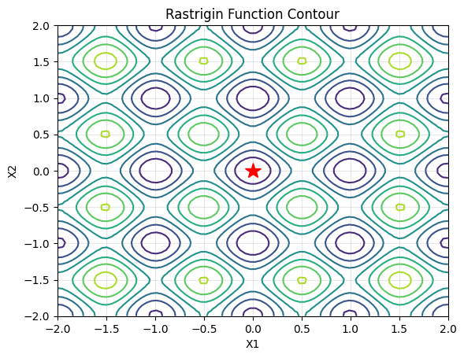
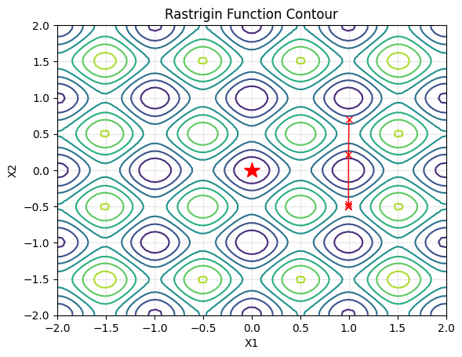
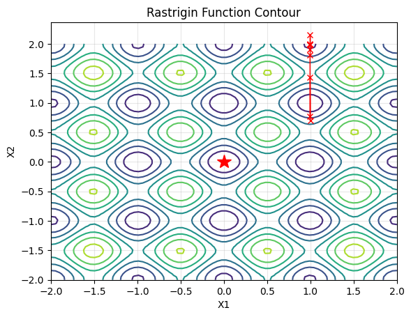
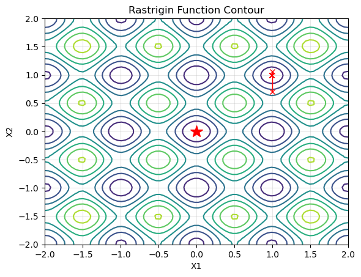
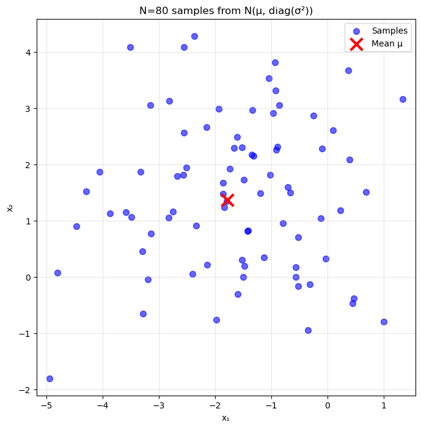
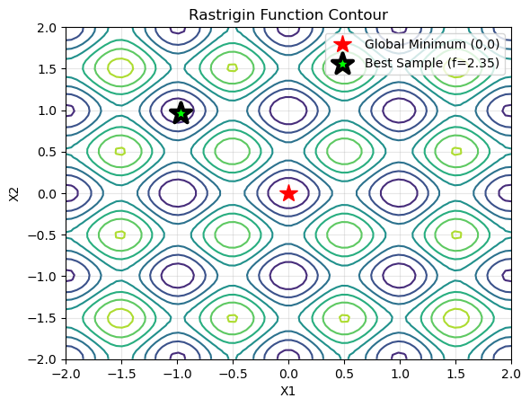
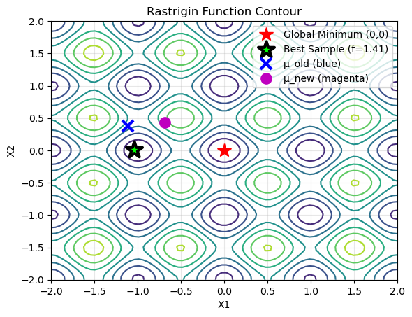
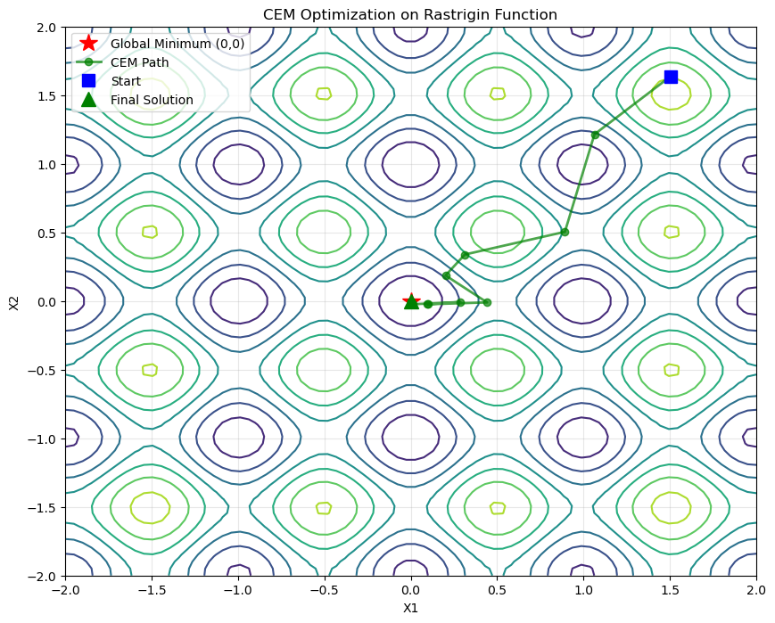
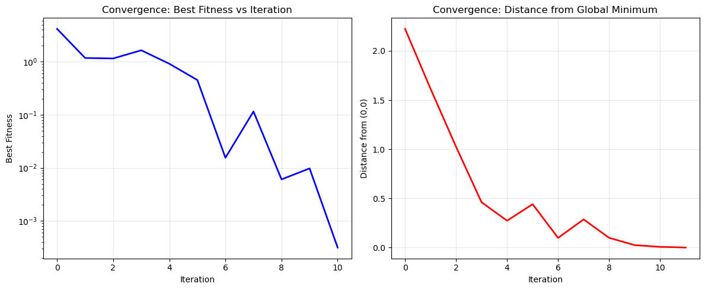

# FRA502_HW_6703
This repository contains the homework assignments of optimization for the FRA502 course

## Table of Contents
- [Objective](#objective)
- [Rastrigin Function](#rastrigin-function)
- [Optimization Algorithms](#optimization-algorithms)
  - [Newton's Method](#newtons-method)
    - [Gradient and Hessian Calculation](#gradient-and-hessian-calculation)
    - [Add Damping Factor to Hessian Matrix](#add-damping-factor-to-hessian-matrix)
    - [Add Line Search with Armijo Backtracking](#add-line-search-with-armijo-backtracking)
    - [Newton's Method Summary](#newtons-method-summary)
  - [Cross-Entropy Method (CEM)](#cross-entropy-method-cem)
    - [Step 1: Initialize Sampling Distribution](#step-1-initialize-sampling-distribution)
    - [Step 2: Evaluate each individual in the population](#step-2-evaluate-each-individual-in-the-population)
    - [Step 3: Select the best M < N individuals](#step-3-select-the-best-m--n-individuals)
    - [Step 4: Find Sample Mean and Sample Variance](#step-4-find-sample-mean-and-sample-variance)
    - [Step 5: Update the Sampling Distribution](#step-5-update-the-sampling-distribution)
    - [Full Implementation](#full-implementation)
    - [CEM Summary](#cem-summary)
- [Member](#member)

## Objective
The objective of this homework is to implement optimization algorithms for the 
Rastrigin function that can avoid getting stuck in local minima and successfully 
find the global minimum.



## Rastrigin Function
The Rastrigin function is a non-convex function used as a performance test problem for optimization algorithms. It is a typical example of a non-linear multimodal function. The function of this homework is defined by the formula:

$f(x) = 10d + \sum_{i=1}^{d} (x_i^2 - 10\cos(2\pi x_i))$

where:
- x is a numpy array of shape (d, 1)
- A = 10
- d is the dimension of x
- $x_i$ is the i-th element of x

The range of interest for x is set between -2 and 2 for each dimension with N = 80 grid points.


In this homework we implement optimization algorithms to find the global minimum of the Rastrigin function, treating it as an **objective (cost) function**.


## Optimization Algorithms
In this homework, we will implement the following optimization algorithms:
1. Newton's Method **(cannot find the global minimum by itself)**
   - Gradient and Hessian calculation
   - Damping the Hessian
   - Line search with Armijo backtracking
2. Cross-Entropy Method (CEM) **(can reach the global minimum)**


## Newton's Method
Newton's Method is an iterative optimization algorithm that uses the first and second derivatives of the objective function to find the minimum. The update rule for Newton's Method is given by:

1) First linearize around the current estimate $\boldsymbol{x}_k$:

$f(\boldsymbol{x}_k + \Delta\boldsymbol{x})\approx f(\boldsymbol{x}_k) + \frac{\partial f}{\partial\boldsymbol{x}}\Big|_{\boldsymbol{x}_k}\Delta\boldsymbol{x}$

2) Then set $f(\boldsymbol{x}_k + \Delta\boldsymbol{x}) = 0$ and solve for $\Delta\boldsymbol{x}$:

$f(\boldsymbol{x}_k) + \frac{\partial f}{\partial\boldsymbol{x}}\Big|_{\boldsymbol{x}_k}\Delta\boldsymbol{x} = 0$

$\Delta\boldsymbol{x} = -\Big(\frac{\partial f}{\partial\boldsymbol{x}}\Big|_{\boldsymbol{x}_k}\Big)^{-1}f(\boldsymbol{x}_k)$

3) And apply the correction $\boldsymbol{x}_{k+1} = \boldsymbol{x}_k + \Delta\boldsymbol{x}$

4) Repeat until convergence

### Gradient and Hessian Calculation
To implement Newton's Method, we need to calculate the gradient and Hessian matrix of the Rastrigin function.

Based on the objective function of the Rastrigin function:
$$f(x) = 10d + \sum_{i=1}^{d} (x_i^2 - 10\cos(2\pi x_i))$$
we need to find the gradient and Hessian matrix of the function.

**Gradient**
For $A = 10$ the gradient of the function is:
$$\nabla f(x) = 2x + 20\pi \sin(2\pi x)$$
**Hessian Matrix**
The Hessian matrix of the function is:
$$H(x) = diag(2 + 40\pi^2 \cos(2\pi x_i))$$
where $diag$ denotes a diagonal matrix with the specified elements on the diagonal.


```python
# ความชัน
def gradient_f(x):
    A = 10.
    return 2 * x + A * 2 * np.pi * np.sin(2 * np.pi * x)

# Hessian matrix หรือความโค้ง
def hessian_f(x):
    A = 10.
    diagonal_elements = 2 + 4 * (np.pi**2) * A * np.cos(2 * np.pi * x.T)
    return np.diag(diagonal_elements.flatten())
```

Before implementing Newton's method, we need to ensure that our gradient and Hessian functions are correct.  
We’ll use a finite-difference (FD) method to verify them.

Finite differences approximate derivatives numerically:

**Gradient (first derivative)**
For a scalar function $f:\mathbb{R}^d \to \mathbb{R}$ and unit basis $e_i$,
$$
\nabla f(x) \;\approx\;
\begin{bmatrix}
\frac{f(x+\varepsilon e_1)-f(x-\varepsilon e_1)}{2\varepsilon}\\[6pt]
\vdots\\[2pt]
\frac{f(x+\varepsilon e_d)-f(x-\varepsilon e_d)}{2\varepsilon}
\end{bmatrix}.
$$

**Hessian (second derivatives)**
Differentiate the gradient components with the same central difference:
$$
\left[\nabla^2 f(x)\right]_{:,i}
\;\approx\;
\frac{\nabla f(x+\varepsilon e_i)-\nabla f(x-\varepsilon e_i)}{2\varepsilon},
\quad i=1,\dots,d.
$$

Now we can implement Gradient and Hessian to Newton's Method:

```python
def newton_step(x):
    grad = gradient_f(x) 
    hessian = hessian_f(x)
    dx = -np.linalg.solve(hessian, grad)
    return x + dx
```

Now try to run Newton's on Rastrigin function from Set initial point:

```python
# Initial point
x0 = np.array([[1., 0.7]]).T

iterations = 20
px, py = [x[0,0]], [x[1,0]]  # to draw a path

for it in range(1, iterations + 1):
    x = newton_step(x)             # one Newton step (no damping/Armijo)
    fx = float(f(x))        # your scalar objective
    print(f"step {it:2d} | x = {x.ravel()} -> f = {fx:.6f}")
```
And here Result:
```
step  1 | x = [0.99495948 0.21367445] -> f = 8.777979
step  2 | x = [ 0.99495864 -0.46116288] -> f = 20.911374
step  3 | x = [ 0.99495864 -0.50341789] -> f = 21.246083
step  4 | x = [ 0.99495864 -0.50254599] -> f = 21.246232
step  5 | x = [ 0.99495864 -0.50254604] -> f = 21.246232
step  6 | x = [ 0.99495864 -0.50254604] -> f = 21.246232
step  7 | x = [ 0.99495864 -0.50254604] -> f = 21.246232
step  8 | x = [ 0.99495864 -0.50254604] -> f = 21.246232
step  9 | x = [ 0.99495864 -0.50254604] -> f = 21.246232
step 10 | x = [ 0.99495864 -0.50254604] -> f = 21.246232
step 11 | x = [ 0.99495864 -0.50254604] -> f = 21.246232
step 12 | x = [ 0.99495864 -0.50254604] -> f = 21.246232
step 13 | x = [ 0.99495864 -0.50254604] -> f = 21.246232
step 14 | x = [ 0.99495864 -0.50254604] -> f = 21.246232
step 15 | x = [ 0.99495864 -0.50254604] -> f = 21.246232
step 16 | x = [ 0.99495864 -0.50254604] -> f = 21.246232
step 17 | x = [ 0.99495864 -0.50254604] -> f = 21.246232
step 18 | x = [ 0.99495864 -0.50254604] -> f = 21.246232
step 19 | x = [ 0.99495864 -0.50254604] -> f = 21.246232
step 20 | x = [ 0.99495864 -0.50254604] -> f = 21.246232
```



With the initial point `x0 = np.array([[1., 0.7]]).T
` the plain Newton update quickly jumps to large objective values and then stagnates around `f ≈ 21`. The Hessian of the Rastrigin function is indefinite in that region, so the method behaves erratically and fails to make progress toward the global minimum at `(0, 0)` where `f(0,0) = 0`.

### Add Damping Factor to Hessian Matrix
To improve the convergence of Newton's Method, we can add a damping factor to the Hessian matrix. This helps to ensure that the Hessian is positive definite, which is necessary for convergence.

$\boldsymbol{H} = \nabla^2_{\boldsymbol{x}}f(\boldsymbol{x}_k)$

$\text{while } \boldsymbol{H}\preceq 0:$

$\quad\boldsymbol{H} = \boldsymbol{H} + \beta\boldsymbol{I}$

$\Delta\boldsymbol{x} = -\boldsymbol{H}^{-1}\nabla_{\boldsymbol{x}}f(\boldsymbol{x}_k)$

$\boldsymbol{x}_{k+1} = \boldsymbol{x}_k + \Delta\boldsymbol{x}$

```python
def is_pos_def(x):
    """ Check if matrix is positive definite """
    return np.all(np.linalg.eigvals(x) > 0)

def damped_newton_step(x, beta = 100.):
    """ Damped Newton step with damping factor `beta` """
    grad = gradient_f(x) 
    hessian = hessian_f(x)
    d = hessian.shape[0]
    I = np.eye(d)
    while not is_pos_def(hessian):
        hessian += beta * I

    dx = -np.linalg.solve(hessian, grad)
    return x + dx 
```
Now try to run Damped Newton's on Rastrigin function from Set initial point:

```python
# Initial point
x0 = np.array([[1., 0.7]]).T
iterations = 20
px, py = [x[0,0]], [x[1,0]]  # to draw a path

for it in range(1, iterations + 1):
    x = damped_newton_step(x)             # one Newton step (no damping/Armijo)
    fx = float(f(x))        # your scalar objective
    print(f"step {it:2d} | x = {x.ravel()} -> f = {fx:.6f}")
```
And here Result:

```
step  1 | x = [0.9966487  1.42941263] -> f = 22.071241
step  2 | x = [0.99580728 0.77272786] -> f = 10.169025
step  3 | x = [0.9949587  1.81503654] -> f = 10.315731
step  4 | x = [0.99495864 2.1551141 ] -> f = 10.024573
step  5 | x = [0.99495864 1.9033898 ] -> f = 6.404335
step  6 | x = [0.99495864 2.00157601] -> f = 5.001756
step  7 | x = [0.99495864 1.98991841] -> f = 4.974790
step  8 | x = [0.99495864 1.98991223] -> f = 4.974790
step  9 | x = [0.99495864 1.98991223] -> f = 4.974790
step 10 | x = [0.99495864 1.98991223] -> f = 4.974790
step 11 | x = [0.99495864 1.98991223] -> f = 4.974790
step 12 | x = [0.99495864 1.98991223] -> f = 4.974790
step 13 | x = [0.99495864 1.98991223] -> f = 4.974790
step 14 | x = [0.99495864 1.98991223] -> f = 4.974790
step 15 | x = [0.99495864 1.98991223] -> f = 4.974790
step 16 | x = [0.99495864 1.98991223] -> f = 4.974790
step 17 | x = [0.99495864 1.98991223] -> f = 4.974790
step 18 | x = [0.99495864 1.98991223] -> f = 4.974790
step 19 | x = [0.99495864 1.98991223] -> f = 4.974790
step 20 | x = [0.99495864 1.98991223] -> f = 4.974790
```


With damping (`beta = 100`) the Hessian is forced to be positive definite, so the iterates stop exploding. They still drift into a neighboring basin, though, and settle at a local minimum with `f ≈ 4.97`, far above the global optimum.

### Add Line Search with Armijo Backtracking
To further improve the convergence of Newton's Method, we can add a line search with Armijo backtracking. This helps to ensure that each step taken by the algorithm results in a sufficient decrease in the objective function.

**Algorithm:**

1. Initialize: $\alpha = 1$

2. While the following condition holds:

$$f(\boldsymbol{x}_k + \alpha\Delta\boldsymbol{x}) > f(\boldsymbol{x}_k) + b\alpha\nabla_{\boldsymbol{x}}f(\boldsymbol{x}_k)^{\top}\Delta\boldsymbol{x}$$

   Reduce step size:
   
$$\alpha \leftarrow c\alpha$$

3. Update position:

$$\boldsymbol{x}_{k+1} = \boldsymbol{x}_k + \alpha\Delta\boldsymbol{x}$$

where $0<c<1$ and $b$ is something small.

```python
# implemnt damped _ armijo newton step
def armijo_newton_step(x, beta = 1., b = 0.1, c = 0.5):
    grad = gradient_f(x) 
    hessian = hessian_f(x)

    d = hessian.shape[0]
    I = np.eye(d)

    while not is_pos_def(hessian):
       hessian += beta * I

    dx = -np.linalg.solve(hessian, grad)
    a = 1.0
    fx = f(x)
    gT_dx = (grad.T @ dx).item()

    while f(x + a*dx) > fx + b * a * gT_dx:
        a = c * a
    return x + a * dx
``` 
Now try to run Damped Armijo Newton's on Rastrigin function from Set initial point:

```python
# Initial point
x0 = np.array([[1., 0.7]]).T
iterations = 20
px, py = [x[0,0]], [x[1,0]]  # to draw a path

for it in range(1, iterations + 1):
    x = armijo_newton_step(x)             # one Newton step (no damping/Armijo)
    fx = float(f(x))        # your scalar objective
    print(f"step {it:2d} | x = {x.ravel()} -> f = {fx:.6f}")
```
And here Result:

```
step  1 | x = [0.99999988 1.05757579] -> f = 2.765710
step  2 | x = [0.99495948 0.99197633] -> f = 1.991681
step  3 | x = [0.99495864 0.99495987] -> f = 1.989918
step  4 | x = [0.99495864 0.99495864] -> f = 1.989918
step  5 | x = [0.99495864 0.99495864] -> f = 1.989918
step  6 | x = [0.99495864 0.99495864] -> f = 1.989918
step  7 | x = [0.99495864 0.99495864] -> f = 1.989918
step  8 | x = [0.99495864 0.99495864] -> f = 1.989918
step  9 | x = [0.99495864 0.99495864] -> f = 1.989918
step 10 | x = [0.99495864 0.99495864] -> f = 1.989918
step 11 | x = [0.99495864 0.99495864] -> f = 1.989918
step 12 | x = [0.99495864 0.99495864] -> f = 1.989918
step 13 | x = [0.99495864 0.99495864] -> f = 1.989918
step 14 | x = [0.99495864 0.99495864] -> f = 1.989918
step 15 | x = [0.99495864 0.99495864] -> f = 1.989918
step 16 | x = [0.99495864 0.99495864] -> f = 1.989918
step 17 | x = [0.99495864 0.99495864] -> f = 1.989918
step 18 | x = [0.99495864 0.99495864] -> f = 1.989918
step 19 | x = [0.99495864 0.99495864] -> f = 1.989918
step 20 | x = [0.99495864 0.99495864] -> f = 1.989918
```


Armijo backtracking makes the update more stable and the objective decreases smoothly, but the iterates still settle at a local minimum because the function is highly multimodal.


### Newton's Method Summary

| Method | Final Position | Final Fitness | Global Min? |
|--------|---------------|---------------|-------------|
| Basic Newton | [0.995, -0.503] | 21.246 | ❌ Local max |
| + Damping | [0.995, 1.990] | 4.975 | ❌ Local min |
| + Armijo | [0.995, 0.995] | 1.990 | ❌ Local min |

**Conclusion:** All gradient-based methods failed to find global minimum at [0,0].


## Cross-Entropy Method (CEM)
The Cross-Entropy Method (CEM) is a stochastic optimization algorithm that uses a population-based approach to find the minimum of an objective function. The algorithm works by iteratively sampling a population of candidate solutions from a probability distribution, evaluating their fitness, and updating the distribution based on the best-performing candidates.

Here is how CEM works step by step:

First, recall the multivariate Gaussian distribution:

$$\mathcal N(x;\mu,\Sigma)
= \frac{1}{(2\pi)^{d/2}\,|\Sigma|^{1/2}}
\exp\!\left(-\tfrac12 (x-\mu)^{\top}\Sigma^{-1}(x-\mu)\right)$$

Where:
- $x$ is the variable
- $\mu$ is the mean vector
- $\Sigma$ is the covariance matrix
- $d$ is the dimension of $x$


### Step 1: Initialize Sampling Distribution

Sample a population of N candidate solutions from a multivariate Gaussian distribution:

$$\mathcal{N}(\boldsymbol{\mu}, \text{diag}(\boldsymbol{\sigma}^2))$$

Where:
- $\boldsymbol{\mu} \in \mathbb{R}^d$ is the mean vector (center of search)
- $\boldsymbol{\sigma}^2 = [\sigma_1^2, \sigma_2^2, \ldots, \sigma_d^2]$ is the variance vector
- $\text{diag}(\boldsymbol{\sigma}^2)$ is the diagonal covariance matrix

The diagonal covariance matrix $\Sigma$ has the form:

$$
\Sigma = \begin{pmatrix} 
\sigma_1^2 & 0 & \cdots & 0 \\\\ 
0 & \sigma_2^2 & \cdots & 0 \\\\ 
\vdots & \vdots & \ddots & \vdots \\\\ 
0 & 0 & \cdots & \sigma_d^2 
\end{pmatrix}
$$

**Note:** Using a diagonal covariance assumes independence between dimensions (appropriate for the Rastrigin function).

And then generate a population of size $N,\mathcal{P} = \{x_1, x_2, \ldots, x_N\}$ by sampling from the distribution, where $x_i \sim \mathcal{N}(\boldsymbol{\mu}, \text{diag}(\boldsymbol{\sigma}^2))$.

The code below illustrates this step:
- `n_dim`: number of dimensions
- `N`: population size
- `mu_k`: initial mean vector (randomly initialized within bounds)
- `sigma2_k`: initial variance vector (set to a large value for exploration)
- `cov_k`: diagonal covariance matrix constructed from `sigma2_k`
- `distribution`: multivariate normal distribution object from `scipy.stats` initialized with `mu_k` and `cov_k`
- `population`: sampled candidate solutions from the distribution

```python
from scipy.stats import multivariate_normal

n_dim = 2           # Number of dimensions
N = 80              # Population size
mu_k = np.random.uniform(-2, 2, n_dim) 
sigma2_k = np.array([2.0, 2.0])  # Large initial variance for exploration
cov_k = np.diag(sigma2_k)
# Create the multivariate normal distribution
distribution = multivariate_normal(mean=mu_k, cov=cov_k)
# Sample N points from this distribution
population = distribution.rvs(size=N)
```


### Step 2: Evaluate each individual in the population
Based on 
$$\boldsymbol{f} = [f(x_1), f(x_2), \ldots, f(x_N)]^T$$

where $F(x_i)$ is the fitness of individual $x_i$ in the population.

```python
fitness = []
for i in range(N):
    f_xi = f(population[i].reshape(-1, 1))  # ← Add .reshape(-1, 1)
    fitness.append(f_xi)

fitness = np.array(fitness)
print(f"Number of fitness values: {len(fitness)}")
best_idx = np.argmin(fitness)
print(f"Best fitness: {fitness[best_idx]:.6f} at index {best_idx}")
print(f"Best position: {population[best_idx]}")
```
And here Result:

```
Number of fitness values: 80
Best fitness: 2.352342 at index 58
Best position: [-0.96665929  0.96276917]
```



### Step 3: Select the best M < N individuals
In this step we select the best $M < N$ individuals based on their fitness values. 
$$\mathcal{P}_{\text{elite}} = \{x^{(i)} \mid i \in \text{top-}M\text{ indices of } \boldsymbol{f}\}$$

where $x_i^{elite}$ is the i-th best individual in the population.

```python
M = 10  # Elite size (M < N)
# Get indices of M best individuals (lowest fitness)
elite_indices = np.argsort(fitness)[:M]

# Extract elite population
elite = population[elite_indices]
elite_fitness = fitness[elite_indices]
print(f"Elite size: {len(elite)}")
best_in_elite = np.argmin(elite_fitness)
print(f"Best fitness in elite: {elite_fitness[best_in_elite]:.6f} at index {elite_indices[best_in_elite]}")
print(f"Best position in elite: {elite[best_in_elite]}")

```

And here Result:

```
Elite size: 10
Best fitness in elite: 2.352342 at index 58
Best position in elite: [-0.96665929  0.96276917]
```


### Step 4: Find Sample Mean and Sample Variance
In this step we calculate the sample mean and the sample (population) variance of the elite individuals to update the parameters of the sampling distribution.

**Mean (vector):**

$$
\boldsymbol{\mu}_{k+1} = \frac{1}{M}\sum_{i=1}^{M} x_i^{\text{elite}}
$$

**Variance (per-dimension, population variance):**

$$
\boldsymbol{\sigma}^2_{k+1} = \frac{1}{M}\sum_{i=1}^{M} \left(x_i^{\text{elite}} - \boldsymbol{\mu}_{k+1}\right)^2
$$

**Implementation notes:**

In code these are computed as:
- `mu_k1 = np.mean(elite_population, axis=0)` — Sample mean
- `sigma2_k1 = np.var(elite_population, axis=0)` — Population variance

```python
# First init paramters
mu_k_old = mu_k.copy()
sigma2_k_old = sigma2_k.copy()

# Compute new parameters from elite
mu_k1 = np.mean(elite, axis=0)
sigma2_k1 = np.var(elite, axis=0)

# Update with noise
epsilon = 1e-6
mu_k = mu_k1
sigma2_k = sigma2_k1 + epsilon 
cov_k = np.diag(sigma2_k)     
print("μ_old   =", mu_k_old)
print("μ_new   =", mu_k)
print("σ²_old  =", sigma2_k_old)
print("σ²_new  =", sigma2_k) 
```

And here Result:

```
μ_old   = [-1.94170325  1.83163609]
μ_new   = [-1.50834256  0.49558144]
σ²_old  = [2. 2.]
σ²_new  = [1.05795478 1.61419114]
```



### Step 5: Update the Sampling Distribution
Update the parameters (go back to **step 1**) of the sampling distribution with the new mean and variance and repeat until convergence/stopping criteria 

### Full Implementation 
Now let try implement full function base from step 1-5

```python
def cem(
    n_dim,
    obj_func,
    N=80,
    M=10,
    max_iterations=100,
    init_mu=None,
    init_sigma2=None,
    epsilon=1e-6,
    variance_threshold=1e-8,
    fitness_threshold=1e-3,
    distance_threshold=1e-3,
    target_point=None,
    bounds=(-2, 2),
    verbose=True,
):
    """
    Cross Entropy Method (CEM) optimization

    Parameters
    ----------
    n_dim : int
        Number of dimensions
    obj_func : function
        Objective function to minimize, expects shape (d, 1)
    N : int
        Population size
    M : int
        Elite size (M < N)
    max_iterations : int
        Maximum number of iterations
    init_mu : array-like, optional
        Initial mean vector. If None, randomly initialized
    init_sigma2 : array-like, optional
        Initial variance vector. If None, set to large value
    epsilon : float
        Small noise to prevent variance collapse
    variance_threshold : float
        Stop if variance drops below this
    fitness_threshold : float
        Stop if best fitness is below this
    distance_threshold : float
        Stop if mean is within this distance of target_point
    target_point : array-like, optional
        Known optimum location (defaults to origin)
    bounds : tuple
        (min, max) bounds for initial mean
    verbose : bool
        Print iteration info

    Returns
    -------
    result : dict
        Contains 'x_best', 'f_best', 'iterations', 'mu_history',
        'fitness_history', 'final_variance', 'target_point', 'final_distance'
    """
    
    if init_mu is None:
        mu_k = np.random.uniform(bounds[0], bounds[1], n_dim)
    else:
        mu_k = np.array(init_mu)

    if init_sigma2 is None:
        sigma2_k = np.ones(n_dim) * 2.0  # Large initial variance
    else:
        sigma2_k = np.array(init_sigma2)

    if target_point is None:
        target_point = np.zeros(n_dim)
    else:
        target_point = np.array(target_point)

    mu_history = [mu_k.copy()]
    fitness_history = []
    best_fitness_prev = np.inf

    if verbose:
        print("=" * 60)
        print("Starting Cross Entropy Method (CEM) Optimization")
        print("=" * 60)
        print(f"Dimensions: {n_dim}")
        print(f"Population size: {N}")
        print(f"Elite size: {M}")
        print(f"Initial μ: {mu_k}")
        print(f"Initial σ²: {sigma2_k}")
        print(f"Target point: {target_point}")
        print(f"Distance threshold: {distance_threshold}")
        print("=" * 60)

    for iteration in range(1, max_iterations + 1):
        cov_k = np.diag(sigma2_k)
        distribution = multivariate_normal(mean=mu_k, cov=cov_k)
        population = distribution.rvs(size=N)

        fitness = np.array([obj_func(ind.reshape(-1, 1)) for ind in population])
        best_fitness = np.min(fitness)
        fitness_history.append(best_fitness)

        elite_indices = np.argsort(fitness)[:M]
        elite = population[elite_indices]

        mu_k = np.mean(elite, axis=0)
        sigma2_k = np.var(elite, axis=0) + epsilon

        mu_history.append(mu_k.copy())

        # find distance between mu_k and target_point
        distance = np.linalg.norm(mu_k - target_point)

        if verbose:
            mu_fmt = np.array2string(mu_k, precision=4, separator=', ')
            sigma_fmt = np.array2string(
                sigma2_k,
                precision=2,
                formatter={'float_kind': lambda x: f"{x:.2e}"},
            )
            print(
                f"Iter {iteration:3d} | f_best = {best_fitness:10.6f} | "
                f"μ = {mu_fmt} | σ² = {sigma_fmt} | dist = {distance:.4e}"
            )

        # Check convergence criteria is should smaller then threshold if is optimal
        variance_converged = np.all(sigma2_k < variance_threshold)
        # Check is the best fitness value good enough (if < fitness_threshold mean is close to global minimum)
        fitness_converged = best_fitness < fitness_threshold
        # Check is the mean μ close to the known global minimum
        distance_converged = distance < distance_threshold
        # Check that while iteration is converged or trapped or notting improve 
        no_improvement = abs(best_fitness - best_fitness_prev) < 1e-6

        if (
            variance_converged
            or fitness_converged
            or distance_converged
            or (iteration > 10 and no_improvement)
        ):
            if verbose:
                print("=" * 60)
                print("🎯 CONVERGENCE ACHIEVED!")
                if variance_converged:
                    print("   Reason: Variance collapsed")
                if fitness_converged:
                    print("   Reason: Target fitness reached")
                if distance_converged:
                    print("   Reason: Mean reached target point")
                if iteration > 10 and no_improvement:
                    print("   Reason: No improvement")
            break

        best_fitness_prev = best_fitness

    x_best = mu_k
    f_best = obj_func(x_best.reshape(-1, 1))
    final_distance = np.linalg.norm(x_best - target_point)

    if verbose:
        print("=" * 60)
        print("FINAL RESULTS:")
        print(f"✓ Iterations: {iteration}")
        print(f"✓ Best solution: x* = {x_best}")
        print(f"✓ Best fitness: f(x*) = {f_best:.8f}")
        print(f"✓ Final variance: σ² = {sigma2_k}")
        print(f"✓ Distance to target: {final_distance:.6f}")
        print("=" * 60)

    return {
        'x_best': x_best,
        'f_best': f_best,
        'iterations': iteration,
        'mu_history': np.array(mu_history),
        'fitness_history': np.array(fitness_history),
        'final_variance': sigma2_k,
        'target_point': target_point.copy(),
        'final_distance': final_distance,
    }
```

and here result after run full CEM function:

```
============================================================
Starting Cross Entropy Method (CEM) Optimization
============================================================
Dimensions: 2
Population size: 80
Elite size: 10
Initial μ: [1.50449829 1.63730676]
Initial σ²: [2. 2.]
Target point: [0. 0.]
Distance threshold: 0.001
============================================================
Iter   1 | f_best =   4.162681 | μ = [1.0634, 1.2145] | σ² = [9.76e-01 7.84e-01] | dist = 1.6142e+00
Iter   2 | f_best =   1.177172 | μ = [0.8923, 0.504 ] | σ² = [1.04e+00 2.55e-01] | dist = 1.0248e+00
Iter   3 | f_best =   1.152469 | μ = [0.3131, 0.3386] | σ² = [1.07e+00 2.40e-01] | dist = 4.6118e-01
Iter   4 | f_best =   1.643651 | μ = [0.2015, 0.1861] | σ² = [5.78e-01 1.65e-01] | dist = 2.7427e-01
Iter   5 | f_best =   0.915843 | μ = [ 0.4419, -0.0101] | σ² = [4.04e-01 5.52e-03] | dist = 4.4200e-01
Iter   6 | f_best =   0.451738 | μ = [ 0.0965, -0.0238] | σ² = [4.63e-01 2.14e-03] | dist = 9.9370e-02
Iter   7 | f_best =   0.015477 | μ = [ 0.2873, -0.0074] | σ² = [2.08e-01 1.27e-03] | dist = 2.8744e-01
Iter   8 | f_best =   0.115354 | μ = [ 0.0985, -0.0183] | σ² = [8.99e-02 3.58e-04] | dist = 1.0023e-01
Iter   9 | f_best =   0.006046 | μ = [ 0.0106, -0.0236] | σ² = [6.89e-04 3.34e-04] | dist = 2.5896e-02
Iter  10 | f_best =   0.009743 | μ = [ 0.0042, -0.0072] | σ² = [5.00e-05 2.77e-05] | dist = 8.3781e-03
Iter  11 | f_best =   0.000314 | μ = [ 0.0001, -0.0014] | σ² = [1.05e-05 6.11e-06] | dist = 1.4107e-03
============================================================
🎯 CONVERGENCE ACHIEVED!
   Reason: Target fitness reached
...
✓ Best fitness: f(x*) = 0.00039479
✓ Final variance: σ² = [1.05360771e-05 6.10560599e-06]
✓ Distance to target: 0.001411
```



Note that the implementation reports the current mean $μ$ as `x*`; the elite individual that achieved the printed best fitness is stored separately in the run history.

### CEM Summary

Based on the results we can plot the convergence graph: 



From these runs CEM reached a point very close to the global minimum within 11 iterations. The elite fitness dropped from roughly `4.16` with the mean `μ` about `1.6` units away from the origin to a best fitness of `3.1e-4` with `‖μ‖ ≈ 1.4e-3`. The left panel shows a near-linear decrease of the best fitness on the log scale, while the right panel tracks the mean marching toward `(0, 0)` with small stochastic oscillations. In short, CEM avoided the local minima that trapped the Newton variants and navigated to the basin containing the global optimum.


## Member
- ศิวรุตม์ จุลพรหม, 67340800002 
- พัฒนรัตน์ จีดจีน, 68430700410
- พีรดนย์ เรืองแก้ว, 67340700403

